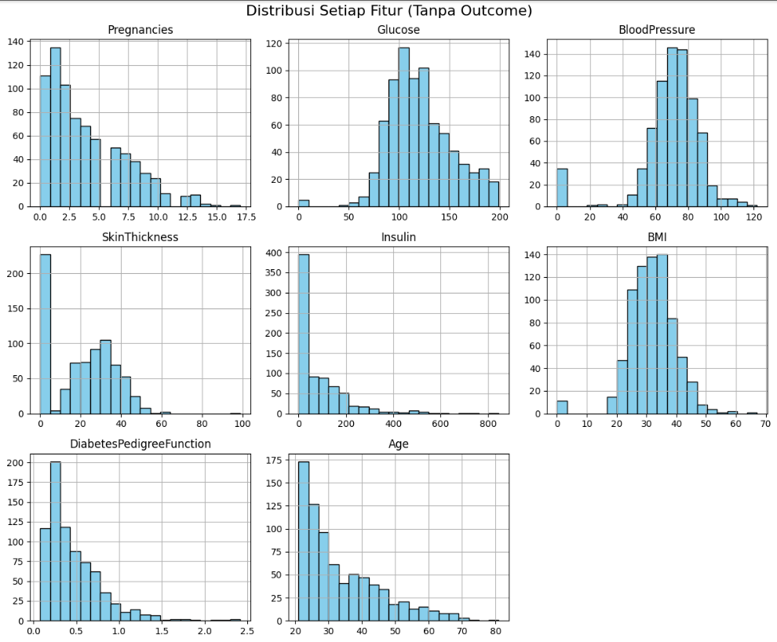
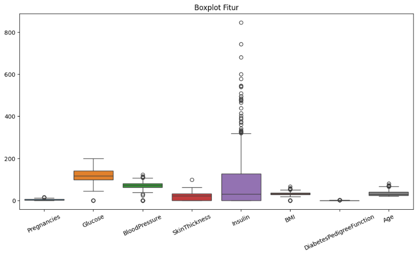
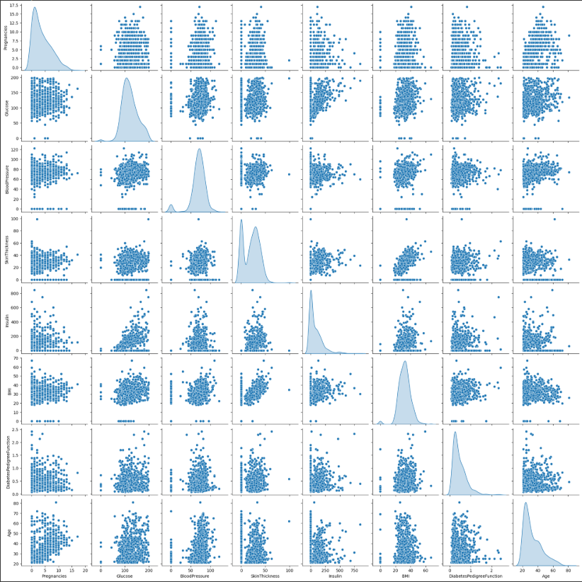
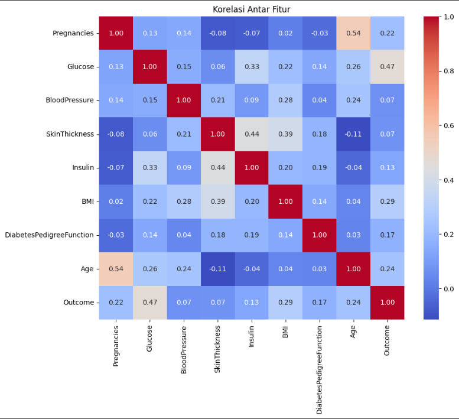
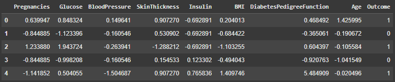
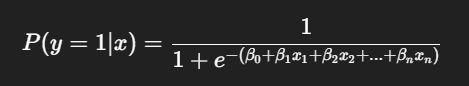
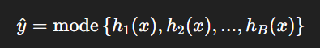
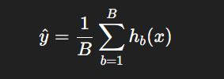
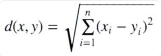
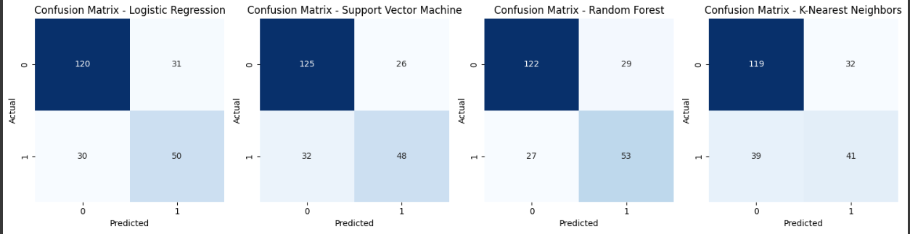

# Laporan Proyek Machine Learning - Elfin Darmawan

## Domain Proyek
### Latar Belakang

Diabetes mellitus adalah gangguan metabolik kronis yang ditandai dengan tingginya kadar glukosa dalam darah (hiperglikemia). Penyakit ini menjadi salah satu penyebab utama kematian di dunia dan merupakan beban besar bagi sistem kesehatan global. Menurut World Health Organization (WHO), sekitar 422 juta orang di seluruh dunia hidup dengan diabetes, dan hampir 1,5 juta kematian setiap tahun disebabkan langsung oleh penyakit ini. Jumlah penderita diperkirakan akan terus meningkat secara signifikan dalam beberapa dekade mendatang, terutama di negara berkembang yang sedang mengalami transisi gaya hidup.

### Kenapa Masalah Ini Penting?

Kebanyakan deteksi diabetes masih dilakukan melalui pemeriksaan langsung seperti tes darah yang bisa mahal dan memakan waktu. Dengan meningkatnya jumlah pasien, rumah sakit atau klinik membutuhkan sistem pendukung keputusan yang cepat dan efisien dalam mendeteksi risiko diabetes hanya dari data kesehatan dasar.

Dengan kemajuan teknologi data dan machine learning, kini dimungkinkan untuk membangun sistem yang dapat memprediksi kemungkinan seseorang menderita diabetes hanya dari data kesehatan dasar seperti kadar glukosa, tekanan darah, indeks massa tubuh (BMI), jumlah kehamilan, usia, dan riwayat keluarga.

### Referensi:
World Health Organization. (2021). Diabetes. https://www.who.int/news-room/fact-sheets/detail/diabetes

American Diabetes Association. (2020). Standards of Medical Care in Diabetes. https://care.diabetesjournals.org

Centers for Disease Control and Prevention (CDC).
National Diabetes Statistics Report (2020).
https://www.cdc.gov/diabetes/data/statistics-report/index.html
## Business Understanding
### Problem Statements

Diabetes merupakan penyakit kronis yang dapat menyebabkan komplikasi serius jika tidak terdeteksi sejak dini. Pemeriksaan laboratorium sebagai metode diagnosis memerlukan biaya dan waktu, serta tidak selalu tersedia di daerah dengan fasilitas kesehatan terbatas. Oleh karena itu, dibutuhkan suatu sistem prediksi berbasis machine learning yang mampu mengidentifikasi kemungkinan seseorang menderita diabetes hanya berdasarkan data kesehatan dasar seperti kadar glukosa, tekanan darah, BMI, usia, dan riwayat kehamilan.

### Goals

- Mengembangkan model prediksi diabetes berbasis machine learning menggunakan data kesehatan dasar.
- Meningkatkan kemampuan deteksi dini diabetes melalui prediksi berbasis data.
- Membandingkan performa dari beberapa model (Logistic Regression, Random Forest, dan KNN).
- Menentukan model terbaik berdasarkan metrik evaluasi klasifikasi.

### Solution statements
Untuk mencapai tujuan tersebut, berikut solusi yang dirancang:

1. Membangun beberapa model machine learning:
   - **Logistic Regression:** Sebagai baseline model karena sederhana dan interpretatif.
   - **Support Vector Machine:** Kuat dalam pemisahan kelas non-linear.
   - **Random Forest:** Untuk menangani hubungan non-linear dan interaksi antar fitur.
   - **K-Nearest Neighbors (KNN):** Sebagai metode berbasis jarak yang mudah digunakan.
2. Melakukan training dan evaluasi model menggunakan data yang telah dibersihkan dan diproses.
3. Menggunakan metrik evaluasi klasifikasi yang relevan untuk menilai kinerja model:
   - **Accuracy:** Seberapa sering model membuat prediksi yang benar.
   - **Precision:** Seberapa banyak dari prediksi positif yang benar-benar positif.
   - **Recall:** Seberapa banyak kasus positif yang berhasil ditangkap model.
   - **F1-score:** Harmoni antara precision dan recall.
4. Memilih model terbaik berdasarkan performa evaluasi dan stabilitasnya pada data uji.

## Data Understanding
Dataset ini merupakan dataset kesehatan yang digunakan untuk memprediksi apakah seseorang menderita diabetes berdasarkan parameter diagnostik medis dasar. Dataset ini berasal dari penelitian National Institute of Diabetes and Digestive and Kidney Diseases, dan digunakan dalam berbagai proyek pembelajaran mesin dan statistik.

Sumber dataset:
https://www.kaggle.com/datasets/akshaydattatraykhare/diabetes-dataset

### Variabel-variabel pada Diabetes dataset adalah sebagai berikut:
1. **Pregnancies**               : Jumlah kehamilan pasien
2. **Glucose**                   : Kadar glukosa dalam darah (mg/dL)
3. **BloodPressure**             : Tekanan darah diastolik (mm Hg)
4. **SkinThickness**             : Ketebalan lipatan kulit triceps (mm)
5. **Insulin**                   : Kadar insulin serum (mu U/ml)
6. **BMI**                       : Body Mass Index (berat/tinggi² dalam kg/m²)
7. **DiabetesPedigreeFunction**  : Indeks silsilah diabetes (riwayat keluarga)
8. **Age**                       : Usia pasien (tahun)
9. **Outcome**                   : Label target (1 = diabetes, 0 = tidak diabetes)

### Exploratory Data Analysis (EDA)
- Menampilkan dan mengecek informasi umum dataset menggunakan `.info`
```
<class 'pandas.core.frame.DataFrame'>
RangeIndex: 768 entries, 0 to 767
Data columns (total 9 columns):
 #   Column                    Non-Null Count  Dtype  
---  ------                    --------------  -----  
 0   Pregnancies               768 non-null    int64  
 1   Glucose                   768 non-null    int64  
 2   BloodPressure             768 non-null    int64  
 3   SkinThickness             768 non-null    int64  
 4   Insulin                   768 non-null    int64  
 5   BMI                       768 non-null    float64
 6   DiabetesPedigreeFunction  768 non-null    float64
 7   Age                       768 non-null    int64  
 8   Outcome                   768 non-null    int64  
dtypes: float64(2), int64(7)
memory usage: 54.1 KB
```
Pada dataset ini, untuk setiap kolom tertera 768 non-null. Hal ini menunjukan bahwa tidak ada nilai yang hilang (missing value) pada dataset. Kolom-kolom pada dataset ini mayoritas tipe datanya adalah integer, kecuali kolom `BMI` dan `DiabetesPedigreeFunction` tipe datanya float.
- Melihat statistik deskriptif dari dataset menggunakan `.describe`
```
        Pregnancies	Glucose	        BloodPressure	SkinThickness	Insulin	        BMI	   DiabetesPedigreeFunction	Age	Outcome
count	768.000000	768.000000	768.000000	768.000000	768.000000	768.000000	768.000000	768.000000	768.000000
mean	3.845052	120.894531	69.105469	20.536458	79.799479	31.992578	0.471876	33.240885	0.348958
std	3.369578	31.972618	19.355807	15.952218	115.244002	7.884160	0.331329	11.760232	0.476951
min	0.000000	0.000000	0.000000	0.000000	0.000000	0.000000	0.078000	21.000000	0.000000
25%	1.000000	99.000000	62.000000	0.000000	0.000000	27.300000	0.243750	24.000000	0.000000
50%	3.000000	117.000000	72.000000	23.000000	30.500000	32.000000	0.372500	29.000000	0.000000
75%	6.000000	140.250000	80.000000	32.000000	127.250000	36.600000	0.626250	41.000000	1.000000
max	17.000000	199.000000	122.000000	99.000000	846.000000	67.100000	2.420000	81.000000	1.000000
```
Terlihat nilai tengah setiap kolom, contohnya: Rata-rata jumlah kehamilan adalah sekitar 3.85. Rata-rata kadar glukosa adalah sekitar 120.9. Selain itu, mengukur seberapa tersebar nilai-nilai dalam setiap kolom dari nilai rata-ratanya. Standar deviasi yang lebih tinggi menunjukkan penyebaran data yang lebih luas. Contohnya, standar deviasi untuk Glucose (31.97) lebih tinggi daripada Pregnancies (3.37), menunjukkan variasi kadar glukosa yang lebih besar dibandingkan dengan jumlah kehamilan. Perhatikan juga standar deviasi yang sangat tinggi pada kolom Insulin (115.24), mengindikasikan variasi nilai insulin yang signifikan. Beberapa kolom memiliki nilai minimum 0, sehingga memerlukan penanganan khusus pada kolom tersebut.

- Mengecek Missing Value dan data duplikat menggunakan `.isnull().sum()` dan `.duplicated().sum()`
```bash
Pregnancies	                0
Glucose	                        0
BloodPressure	                0
SkinThickness	                0
Insulin	                        0
BMI	                        0
DiabetesPedigreeFunction	0
Age	                        0
Outcome	                        0
dtype: int64
```
Hasil dari pengecekan missing value diatas menunjukan bahwa tidak ada nilai null atau hilang dalam dataset untuk semua kolom yang diperiksa. Sehingga kita tidak perlu melakukan penanganan untuk missing value.
```bash
Jumlah data duplikat: 0
```
Pada tahap ini adalah pengecekan jumlah data duplikat, bisa kita lihat bahwa tidak ada data duplikat sehingga bisa melanjutkan ke tahap selanjutnya yaitu mengecek distribusi fitur dan outliers.

- Distribusi Fitur
  


`Pregnancies` dan `DiabetesPedigreeFunction` cenderung right-skewed, dengan sebagian besar nilai berada di sisi kiri dan ekor yang memanjang ke kanan. `Glucose`, `BloodPressure`, `BMI`, dan `Age` distribusinya tampak lebih mendekati distribusi normal, meskipun dengan sedikit skewness pada beberapa fitur. `SkinThickness` dan `Insulin` sangat right-skewed, dengan banyak nilai terkonsentrasi di nilai rendah dan beberapa nilai ekstrem yang tinggi.

- Boxplot untuk melihat Outlier (Tanpa Outcome)
  


Visualisasi boxplot dengan jelas memperlihatkan keberadaan outlier, terutama pada fitur Insulin yang memiliki sebaran nilai ekstrem yang cukup jauh. Fitur SkinThickness juga menunjukkan beberapa nilai di luar batas normal. Meskipun demikian, mengingat tujuan proyek ini adalah mendeteksi dini diabetes, keberadaan nilai-nilai ekstrem ini dipertahankan. Boxplot juga mengindikasikan adanya perbedaan rentang data yang cukup besar antar fitur. Misalnya, fitur Insulin memiliki skala nilai yang jauh lebih tinggi dibandingkan fitur DiabetesPedigreeFunction. Variasi rentang ini menjadi pertimbangan penting untuk tahap pemodelan machine learning. Jika tidak ditangani, model dapat menjadi bias terhadap fitur dengan skala yang lebih besar. Oleh karena itu, normalisasi atau standarisasi fitur kemungkinan akan diperlukan untuk memastikan semua fitur berkontribusi secara adil dalam membangun model prediksi diabetes yang akurat.

- Mengamati Hubungan antar fitur



`Glucose` dan `BMI` menunjukkan hubungan positif, semakin tinggi kadar glukosa, cenderung BMI juga meningkat. `Pregnancies` dan `Age` menunjukkan hubungan positif, usia yang lebih tua cenderung memiliki jumlah kehamilan lebih banyak. `BMI` vs `Insulin` dan `Glucose` vs `Insulin` juga menunjukkan tren naik, meskipun dengan sebaran yang longgar. Banyak pasangan fitur menunjukkan pola acak (misalnya, `SkinThickness` vs `BloodPressure`), menunjukkan tidak ada korelasi linear yang jelas.


- Korelasi antar fitur
  


`Glucose (0.47)`: Korelasi positif terkuat dengan Outcome. Artinya, semakin tinggi kadar glukosa, semakin besar kemungkinan individu terkena diabetes. `BMI (0.29)`: Korelasi sedang, menunjukkan pengaruh obesitas terhadap risiko diabetes. `Age (0.24)` dan `Pregnancies (0.22)`: Semakin tua usia dan semakin banyak kehamilan, sedikit meningkatkan risiko. `DiabetesPedigreeFunction (0.17)`: Juga memberi kontribusi, meski kecil.

## Data Preparation
Pada tahap ini adalah proses sistematis untuk mengubah data mentah menjadi bentuk yang bersih, konsisten, dan siap digunakan dalam pemodelan machine learning. Tahap ini dilakukan setelah EDA (Exploratory Data Analysis) dan sebelum pelatihan model. Banyak kasus menunjukkan bahwa model yang bagus tidak akan memberikan hasil optimal jika data yang digunakan tidak dipersiapkan dengan baik. Dari hasil EDA, kita bisa melihat apa saja yang perlu dilakukan selanjutnya agar model optimal yaitu seperti normalisasi dan split data.

### Normalisasi Data Menggunakan Standarscaler
```python
# Normalisasi data (Standardisasi)
scaler = StandardScaler()
scaled_features = scaler.fit_transform(df_features)
scaled_df = pd.DataFrame(scaled_features, columns=df_features.columns)
scaled_df['Outcome'] = df['Outcome']
```
Standardisasi adalah teknik untuk mengubah skala fitur-fitur dalam dataset sehingga memiliki rata-rata (mean) sebesar 0 dan deviasi standar (standard deviation) sebesar 1. Melakukan normalisasi pada dataframe tanpa kolom 'Outcome' atau hanya melakukan normalisasi pada kolom input. Lalu membuat dataframe baru setelah normalisasi dan menggabungkan kolom 'Outcome' ke dataframe yang sudah dinormalisasi. Proses normalisasi ini bertujuan agar tidak mengurangi bias ketika modeling terhadap fitur.



Fitur-fitur numerik dalam dataset (Pregnancies hingga Age) telah berhasil distandardisasi, yang ditunjukkan oleh nilai-nilai yang sekarang memiliki rentang di sekitar nol dan tidak lagi mencerminkan skala aslinya. Hal ini diperlukan agar algoritma machine learning tidak bias terhadap fitur dengan skala yang lebih besar. Untuk kolom 'Outcome' tetap berisi nilai asli (0 dan 1) karena kolom tersebut merupakan variabel target.

### Split Dataset
Memisahkan fitur (X) dan target (y) dari dataframe untuk melanjutkan ke tahap modeling dan evaluasi model.
```python
# Memisahkan Data menjadi Training dan Test Set
X = scaled_df.drop('Outcome', axis=1)  # Fitur
y = scaled_df['Outcome']  # Target
```
Lalu membagi data menjadi 70% data latih dan 30% data uji, data latih digunakan untuk melatih atau membangun model dan data uji digunakan untuk mengevaluasi model yang sudah dibangun. Ketika model diuji dengan data yang belum pernah dilihat atau dilatih sebelumnya, model bisa memberikan gambaran yang akurat.
```python
# Split data menjadi 70/30
X_train, X_test, y_train, y_test = train_test_split(
    X, y, test_size=0.3, random_state=42)
```
Sehingga ukuran sampel untuk data latih dan data uji sebagai berikut:
```bash
Ukuran data latih: 537 | Ukuran data uji: 231
```
## Modeling
Tahap ini adalah memilih dan melatih model machine learning untuk masalah terkait klasifikasi (dalam kasus ini, memprediksi apakah seseorang memiliki diabetes atau tidak) berdasarkan input di dataset.

**Memilih Model yang Akan Digunakan**

Disini saya menggunakan lebih dari 1 model untuk mencari model yang terbaik untuk mendeteksi diabetes, antara lain:

### 1. Logistic Regression
   
Logistic Regression adalah algoritma supervised learning yang digunakan untuk klasifikasi biner. Model ini memprediksi probabilitas suatu kelas berdasarkan fungsi logistik (sigmoid). Interpretasi model relatif mudah (kita bisa melihat koefisien fitur), efisien secara komputasi, dan bekerja baik untuk masalah klasifikasi linear.



   - Kelebihan:
      - Sederhana dan cepat dilatih.
      - Mudah diinterpretasi (koefisien → pentingnya fitur).
      - Cocok untuk data yang linier terpisah.
   - Kekurangan:
      - Kurang akurat jika hubungan antar fitur dan target tidak linier.
      - Tidak bekerja baik jika banyak outlier atau data tidak seimbang.
      - Tidak menangani hubungan non-linear dengan baik.

### 2. Support Vector Machine (SVM)
SVM adalah algoritma klasifikasi (juga bisa digunakan untuk regresi) yang mencari hyperplane terbaik yang memisahkan dua kelas dengan margin terbesar. SVM bekerja sangat baik untuk data linier dan non-linier dengan bantuan kernel trick.
- Kelebihan
   - Efektif di ruang berdimensi tinggi.
   - Cocok untuk data yang tidak linier (dengan kernel RBF/polynomial).
   - Tahan terhadap outlier dalam beberapa kasus.
- Kekurangan
   - Waktu pelatihan lambat untuk dataset besar.
   - Sulit diinterpretasikan.
   - Sensitif terhadap pemilihan kernel dan parameter C, gamma.

### 3. Random Forest
Random Forest adalah algoritma machine learning yang kuat dan serbaguna, termasuk dalam kategori algoritma ensemble dan sering digunakan untuk tugas klasifikasi dan regresi. 
Berikut Rumus dari Random Forest:

- Untuk Klasifikasi
  


- Untuk Regresi
  


- Kelebihan
   - Lebih tahan terhadap outlier dalam data dibandingkan beberapa model lain
   - Kuat terhadap overfitting
   - Dapat menangani data non-linear dan interaksi fitur dengan baik
   - Memberikan feature importance.
- Kekurangan
   - Kurang interpretabel.
   - Waktu komputasi dan penyimpanan lebih besar.
   - Bisa bias terhadap kelas mayoritas jika data tidak seimbang dan dataset yang besar.

### 4. K-Nearest Neighbors (KNN)
KNN adalah algoritma berbasis instance. Untuk memprediksi kelas suatu titik, ia melihat k tetangga terdekat dan memilih kelas mayoritas dari mereka.
- Euclidean Distance
  


- Kelebihan
  - Sederhana dan mudah dipahami.
  - Tidak memerlukan pelatihan (lazy learner).
  - Dapat bekerja baik pada data yang terdistribusi secara non-linier.
- Kekurangan
  - Sensitif terhadap fitur yang tidak distandarisasi (wajib scaling).
  - Lambat saat prediksi pada dataset besar.
  - Rentan terhadap noise dan fitur yang tidak relevan.
 
### Training Model
```python
# Membuat Model
models = {
    "Logistic Regression": LogisticRegression(random_state=42),
    "Support Vector Machine": SVC(kernel='rbf', random_state=42),
    "Random Forest": RandomForestClassifier(random_state=42),
    "K-Nearest Neighbors": KNeighborsClassifier()
}
```
Menginisialisasi model yang akan digunakan yaitu Logistic Regression,Support Vector Machine, Random Forest, dan K-Nearest Neighbbors. Untuk Logistic Regression, SVM, dan Random Forest parameter `random_state=42` untuk produktibilitas, dan KNN tidak karena bersifat deterministik data dan berdasarkan jarak terdekatnya.

```python
# Latih dan evaluasi model
for i, (name, model) in enumerate(models.items()):
    # Latih model
    model.fit(X_train, y_train)
    # Prediksi
    y_pred = model.predict(X_test)

    accuracy = accuracy_score(y_test, y_pred)
    precision = precision_score(y_test, y_pred, average='binary')
    recall = recall_score(y_test, y_pred, average='binary')
    f1 = f1_score(y_test, y_pred, average='binary')
    cm = confusion_matrix(y_test, y_pred)

    con_metrics[name] = cm
    evaluation_results.append({
        "Model": name,
        "Accuracy": accuracy,
        "Precision": precision,
        "Recall": recall,
        "F1-Score": f1
    })
```
Setelah membagi data untuk data latih dan data uji, model akan dilatih menggunakan data yang sudah dibagi tersebut yaitu X_train dan y_train.

### Hasil Training Model dan Visualisasi Confusion Matrix
Evaluasi Metrik Setiap Model:
```bash
       Model               Accuracy	   Precision	   Recall	F1-Score
	
Logistic Regression	   0.735931	   0.617284	   0.6250	0.621118
Support Vector Machine	   0.748918	   0.648649	   0.6000	0.623377
Random Forest	           0.757576	   0.646341	   0.6625	0.654321
K-Nearest Neighbors	   0.692641	   0.561644	   0.5125	0.535948
```
Model diuji dengan data uji X_test dengan menampilkan hasil seperti diatas:
- Accuracy: Proporsi total prediksi yang benar dari seluruh prediksi.
- Precision: Proporsi prediksi positif yang sebenarnya positif.
- Recall: Proporsi aktual positif yang berhasil diprediksi sebagai positif.
- F1-Score: Rata-rata harmonik dari precision dan recall. Memberikan ukuran tunggal yang menyeimbangkan antara precision dan recall.

### Model Terbaik dari Hasil Training
Berdasarkan seluruh metrik evaluasi, **Random Forest dipilih sebagai model terbaik** untuk memprediksi diabetes karena memberikan hasil prediksi yang lebih akurat dan seimbang, terutama dalam mendeteksi pasien yang benar-benar menderita diabetes.
- Akurasi tertinggi (75.76%)
- Recall tertinggi (66.25%), penting dalam konteks deteksi diabetes karena dapat meminimalkan kesalahan pasien yang sebenarnya sakit tetapi tidak terdeteksi (false negative).
- F1-Score tertinggi, menandakan keseimbangan baik antara Precision dan Recall.

## Evaluation
Proyek ini menggunakan empat metrik utama untuk mengevaluasi performa model machine learning:
1. Accuracy
2. Precision
3. Recall
4. F1-Score
   
Semua metrik ini dihitung berdasarkan confusion matrix.

**Confusion Matrix** adalah sebuah tabel yang digunakan untuk mengevaluasi kinerja model klasifikasi dengan membandingkan hasil prediksi model terhadap label yang sebenarnya (ground truth). Confusion matrix menampilkan jumlah prediksi yang benar dan salah berdasarkan kategori positif dan negatif. Berikut antara lain:
- True Positive (TP): Model memprediksi positif, dan benar (pasien benar-benar menderita diabetes).
- False Positive (FP): Model memprediksi positif, tapi salah (pasien tidak diabetes tapi diklasifikasi positif).
- True Negative (TN): Model memprediksi negatif, dan benar (pasien tidak menderita diabetes).
- False Negative (FN): Model memprediksi negatif, tapi salah (pasien menderita diabetes tapi diklasifikasi negatif).

### 1. Accuracy
Mengukur proporsi prediksi yang benar terhadap total data.

$$
Accuracy = \frac{TP + TN}{TP + TN + FP + FN}
$$

Metrik ini menunjukkan seberapa sering model membuat prediksi yang benar secara keseluruhan. Cocok digunakan jika data memiliki distribusi kelas yang seimbang (jumlah positif dan negatif relatif sama).

### 2. Precision
Precision mengukur berapa banyak dari prediksi positif yang benar-benar positif.

$$
Precision = \frac{TP}{TP + FP}
$$

Precision tinggi berarti model jarang menganggap orang sehat sebagai penderita diabetes (false positive rendah). Sangat penting saat konsekuensi dari kesalahan positif (FP) besar, misalnya salah memberi diagnosa penyakit yang membuat pasien menerima pengobatan tidak perlu.

### 3. Recall
Mengukur proporsi kasus positif yang berhasil terdeteksi dengan benar.

$$
Recall = \frac{TP}{TP + FN}
$$

Sangat penting dalam konteks medis karena kita tidak ingin pasien sakit tidak terdeteksi.

### 4. F1-Score
Harmonik rata-rata antara Precision dan Recall.

$$
F1\text{-}Score = 2 \times \frac{\text{Precision} \times \text{Recall}}{\text{Precision} + \text{Recall}}
$$

F1-Score berguna ketika kita ingin menyeimbangkan antara false positives dan false negatives. Semakin tinggi F1-Score, semakin baik model dalam memprediksi kelas minoritas secara akurat dan konsisten.

### Hasil Proyek Berdasarkan Metrik Evaluasi
- Accuracy, Precision, Recall, F1-Score
  
| Model             | Accuracy | Precision | Recall | F1-Score |
|--------------------| ---------|-----------|--------|----------|
|Logistic Regression	|    0.735931 | 0.617284	|   0.6250 |	0.621118 |
|Support Vector Machine	|   0.748918	|   0.648649	|   0.6000 |	0.623377 |
|**Random Forest**	   |       **0.757576**	|   **0.646341**	|   **0.6625**	| **0.654321** |
|K-Nearest Neighbors	 |  0.692641	|   0.561644	|   0.5125	| 0.535948 |

Random Forest menunjukkan kinerja terbaik secara keseluruhan berdasarkan semua metrik, terutama dalam hal akurasi, recall, dan F1-Score. Ini menjadikannya model yang paling menjanjikan untuk tugas klasifikasi ini berdasarkan hasil evaluasi ini.
Support Vector Machine dan Logistic Regression memiliki kinerja yang cukup mirip dan berada di bawah Random Forest, tetapi jauh lebih baik daripada KNN. SVM menunjukkan presisi yang sedikit lebih baik, sementara Logistic Regression memiliki recall yang sedikit lebih tinggi (meskipun F1-Score SVM sedikit lebih baik).
K-Nearest Neighbors memiliki kinerja yang paling buruk di antara keempat model berdasarkan semua metrik. Ini mengindikasikan bahwa KNN mungkin bukan pilihan yang baik untuk tugas klasifikasi ini dengan konfigurasi saat ini.

- Confusion Matrix


